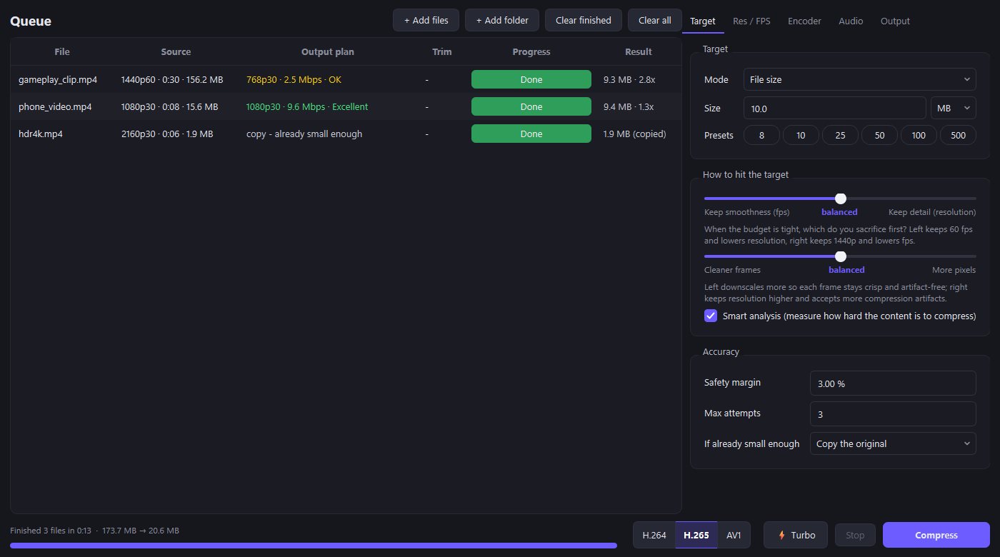

# Video Compressor

Compress videos to an exact file size (Discord's 10 / 50 / 500 MB limits, for example) using your GPU's
hardware encoder. It works out the best resolution, framerate and bitrate for each clip, and you can lock
any of them yourself.



## Features

- **Hits a target size.** Pick a size in MB (or % of original, a bitrate, or constant quality). If an encode
  lands over the target, it's redone with a corrected bitrate. The app also learns how much each encoder
  overshoots, so the first try usually fits.
- **Chooses resolution and fps.** A quick content analysis measures how hard the clip is to compress,
  then picks the resolution/fps combination that looks best for the budget.
  - Two sliders steer it: **keep smoothness ↔ keep detail** and **cleaner frames ↔ more pixels**.
  - Resolution and framerate can each be *auto*, *locked to source*, or *fixed*, with min/max limits.
- **Fast.** NVIDIA NVENC encoding (H.264 / H.265 / AV1), GPU scaling, and NVDEC for HEVC sources.
  **⚡ Turbo** mode trades a little quality for more speed.
- **Batch queue.** Drag in files or whole folders, with 2 encodes running in parallel by default.
- **Trim.** Compress only part of a clip.
- **Audio.** Keep the first track, **mix all tracks** (e.g. OBS game + mic), keep all, or drop audio.
  AAC or Opus.
- **Phone clips.** Converts HDR to SDR and handles rotated videos. Heights mean the short side, so
  portrait videos work as expected.
- **Discord-friendly.** Right-click a finished file → *Copy output file*, then paste it into Discord.
- **CLI** for scripts and batch jobs.

## Requirements

- Windows 10/11 (should also run on Linux/macOS, but only tested on Windows)
- Python 3.10+
- [FFmpeg](https://ffmpeg.org/download.html) (`ffmpeg` and `ffprobe` on your PATH), e.g. `winget install Gyan.FFmpeg`
- An NVIDIA GPU for the fast path (RTX recommended; AV1 encoding needs RTX 40-series).
  Intel QuickSync, AMD AMF and CPU encoders (x264 / x265 / SVT-AV1) work too, just slower.

## Install

```bash
git clone https://github.com/Kanibal02/video-compressor.git
cd video-compressor
pip install -r requirements.txt
```

## Usage

### GUI

Double-click `Video Compressor.pyw` (or run `python "Video Compressor.pyw"`):

1. Drag videos or folders onto the window.
2. Pick a target size, codec, and optionally ⚡ Turbo.
3. Click **Compress**.

The **Output plan** column previews what each file will become before you start; hover it for details.
Settings are saved to `settings.json` next to the app.

### CLI

```bash
python compress.py clip.mp4 -s 10                        # 10 MB, everything automatic
python compress.py clips/ -s 50 -o compressed/           # a whole folder
python compress.py clip.mp4 -s 25 --lock-res             # keep resolution, lower fps instead
python compress.py clip.mp4 -s 25 --fps 30               # fixed 30 fps, resolution automatic
python compress.py clip.mp4 -s 10 --encoder av1_nvenc --turbo
python compress.py clip.mp4 -s 8 --start 0:12 --end 0:40 --audio mix
```

Run `python compress.py -h` for all options.

## Choosing a codec

| Codec | Size efficiency | Plays on |
|---|---|---|
| **H.264** | baseline | Everything: every browser, phone and Discord client |
| **H.265** (default) | ~25% better | Phones, Macs, and PCs with a hardware HEVC decoder. Some browsers and old PCs can't play it |
| **AV1** | ~40% better | Discord desktop and Chrome (decoded in software if needed). Older phones, especially iPhones, may not play it |

If the people watching might be on old devices, use H.264.

## Performance

Measured on an RTX 4070 Super + i5-13600K, full-length real clips, **with OBS's replay buffer running
in the background** (it used ~40% of the GPU encoder the whole time):

| Clip | Target | Before tuning | Now |
|---|---|---|---|
| 1440p60 HEVC OBS recording, 1:13 | 100 MB | 1.97x realtime | 3.3x (H.264) |
| 1080p60 H.264 edit, 0:56 | 25 MB | 2.63x | 4.5x (H.264) |
| 1440p **120 fps** HEVC, 136 Mbps, 2:49 | 100 MB | - | ~5x in every mode (decode-limited) |

Speed tips:

- **The GPU's encoder chip is the bottleneck, and it's shared.** OBS replay buffer, ShadowPlay or
  a stream running in the background take a big share. The app warns you in the status bar when
  another program is using the encoder.
- **⚡ Turbo** measured (same bitrate, 1440p60 clip): H.264 2.5x → 4.4x at −2.7 VMAF (slightly softer in fast
  motion); AV1 2.3x → 4.1x at −0.6 VMAF (hard to see); H.265 → 4.1x.
- **Very high-bitrate 120 fps sources** are limited by decoding, so Turbo doesn't help there.
- **Preset p4 is the default.** On H.264, p5–p7 were slower *and* didn't score higher on VMAF.

## How it works

1. **Probe:** `ffprobe` reads resolution, fps, duration, audio tracks, rotation and HDR info.
2. **Complexity analysis:** five 1-second samples are encoded at a fixed quantizer on the GPU. The bits
   they need show how hard the content is to compress (static desktop vs. fast gameplay).
3. **Planning:** the app models the bitrate each resolution/fps combination needs to look good, and picks
   the one with the smallest weighted loss for your budget and slider settings. It prefers even fps
   divisions (60→30, not 60→48) to avoid judder. Dropping 120→60 fps counts as much less loss than 60→30.
4. **Encode:** NVENC VBR at the computed bitrate, with lanczos GPU scaling (`scale_cuda`). The output
   size is checked afterwards, and the file is re-encoded if it's over the target.

## Project layout

```
vidcomp/engine.py       probing, analysis, planning, ffmpeg command building, encoding (no GUI code)
vidcomp/gui.py          PySide6 desktop app
compress.py             command-line interface
Video Compressor.pyw    double-click launcher for the GUI
```
